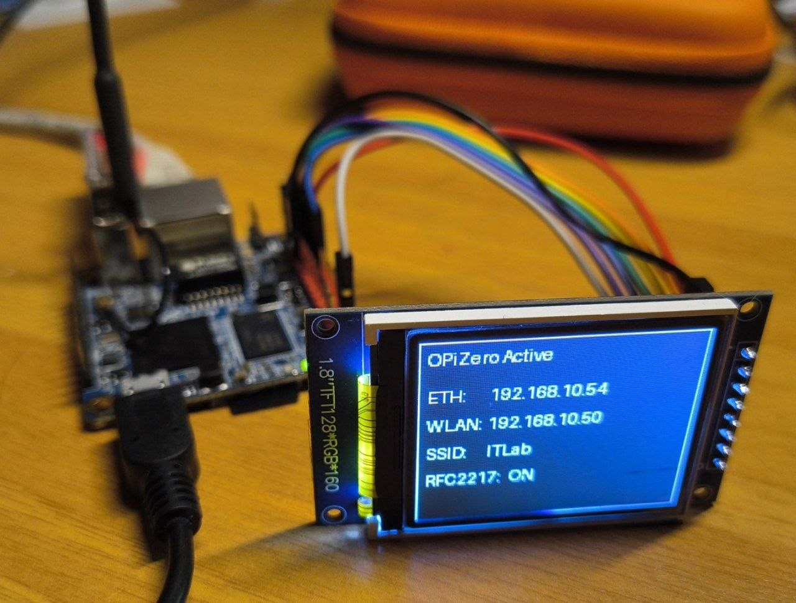

# OPiZero Serial Bridge: A Headless SBC for Remote MCU Programming over RFC2217

This project documents how to configure an ARM single-board computer (SBC) as a network-accessible serial programmer and console using RFC2217. The reference platform is an Orange Pi Zero running Armbian, but most of the setup can be adapted to other Linux SBCs.

The system is intended for remote flashing and serial debugging of Espressif MCUs with `esptool`, where OTA updates are unsuitable and the programming workstation is not physically near the target device.

## Architecture

The SBC exposes a locally attached USB serial device over the network through an RFC2217 server. Wi-Fi onboarding is performed through a temporary access point and captive portal. Once connected, the SBC reports its DHCP address through Telegram. OliveTin optionally provides a web interface to start the RFC2217 server without SSH.

An optional SPI TFT display can show connection state, IP addresses, SSID, and RFC2217 server status.

### Services and Libraries

- [Comitup](https://github.com/davesteele/comitup): Wi-Fi onboarding access point and captive portal.
- [OliveTin](https://github.com/OliveTin/OliveTin): web dashboard for controlled command execution.
- [esptool](https://github.com/espressif/esptool): Espressif tooling and `esp_rfc2217_server`.
- [luma.lcd](https://github.com/rm-hull/luma.lcd): ST7735 SPI TFT display driver.
- [telegram-send](https://github.com/rahiel/telegram-send): Telegram notifications from the SBC.

## Configuration Steps

1. [Base system and prerequisites](docs/01-prerequisites.md): prepare Armbian/Debian, the Python virtual environment, and optional mDNS name resolution.
2. [Wi-Fi onboarding with Comitup](docs/02-wifi-comitup.md): configure a captive portal access point for selecting a wireless network without a local display or keyboard.
3. [Network notifications](docs/03-network-notifications.md): configure Telegram notifications when NetworkManager obtains or loses a network connection.
4. [Optional SPI TFT display](docs/04-tft-display.md): enable an ST7735 display and install the status-display service.
5. [RFC2217 serial service](docs/05-rfc2217.md): install `esptool`, expose a USB serial port, and connect from a remote workstation.
6. [OliveTin dashboard](docs/06-olivetin.md): install and configure the web launcher used to control services and network actions.

## Scope and Security

The reference configuration is designed for a trusted LAN. RFC2217 exposes a serial device and can control reset or boot signals; do not expose it directly to the Internet. Restrict access with network segmentation, a VPN, a firewall, or equivalent controls.

Telegram credentials, Wi-Fi credentials, target serial devices, interface names, GPIO pins, and package architecture must be adapted to the target system.
