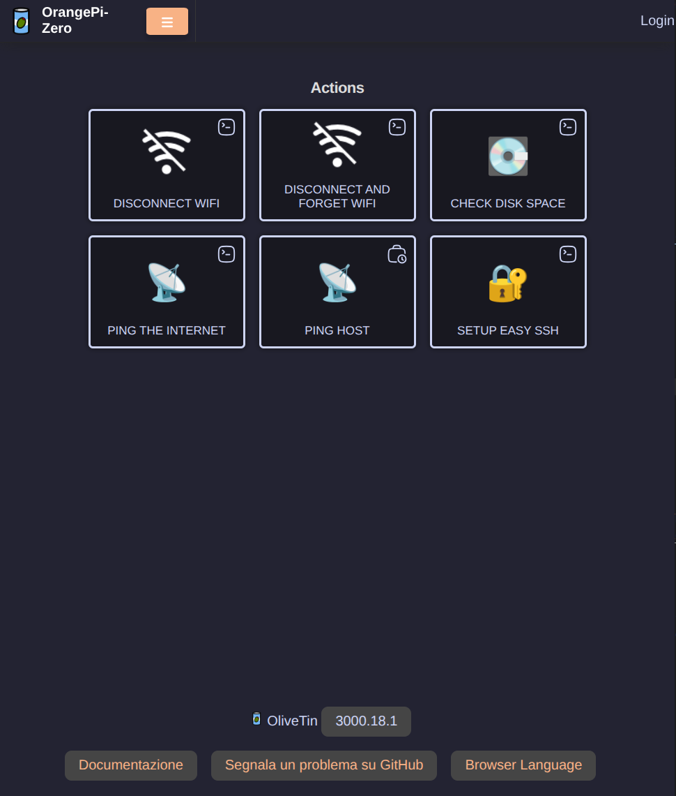
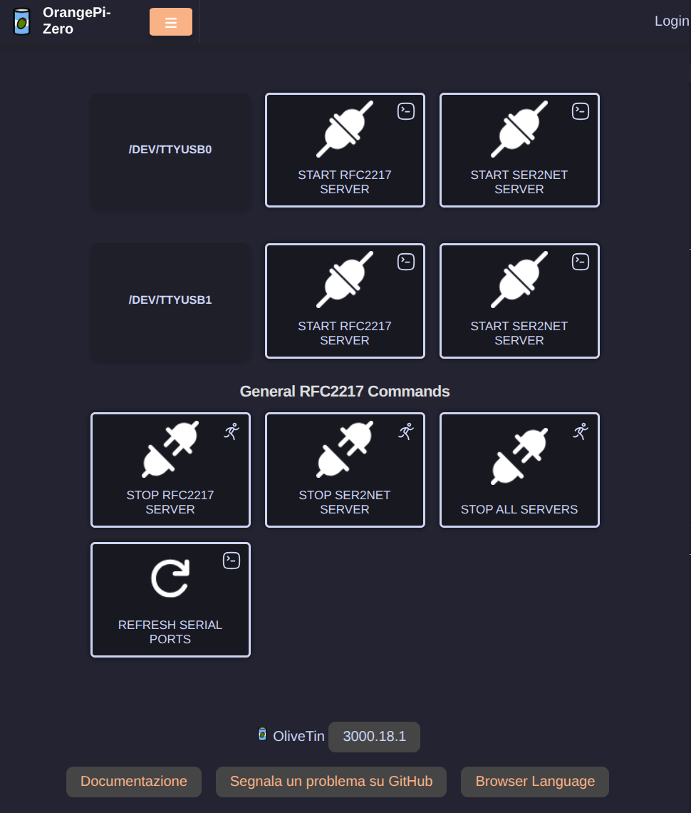

# OliveTin Dashboard

[OliveTin](https://github.com/OliveTin/OliveTin) provides a web UI to run controlled administrative actions on the SBC. In this project it starts and stops the RFC2217 server, lists USB serial ports, disconnects Wi-Fi, and provides basic network and storage diagnostics. It avoids keeping the RFC2217 service permanently active and is an alternative to SSH for routine operations.






## Install OliveTin

Download the release package that matches the SBC architecture. The Orange Pi Zero reference platform requires the ARMv7 package.

```bash
wget https://github.com/OliveTin/OliveTin/releases/latest/download/OliveTin_linux_armv7.deb
dpkg -i OliveTin_linux_armv7.deb
```

If `dpkg` reports unresolved package dependencies, repair them with:

```bash
apt --fix-broken install
```

Enable and start the service:

```bash
systemctl enable --now OliveTin
systemctl status OliveTin
```

Open `http://<sbc-ip>:1337/` to verify the installation. The NetworkManager dispatcher described in [Network Notifications](03-network-notifications.md) sends this address by Telegram after a successful Wi-Fi connection.

## Install Custom Icons

The reference configuration uses custom action icons. Create the destination directory and copy the corresponding PNG files before enabling the related actions:

```bash
install -d -m 755 /etc/OliveTin/custom-webui/icons
```

The configuration refers to the following icon files:

```text
custom-webui/icons/wifi_disconnect.png
custom-webui/icons/connected.png
custom-webui/icons/disconnected.png
custom-webui/icons/usb.png
```

Either provide these files under OliveTin's custom web UI directory or replace the `icon` values with built-in OliveTin icon names.

## Configure OliveTin

Back up the generated configuration before replacing it:

```bash
cp /etc/OliveTin/config.yaml /etc/OliveTin/config.yaml.bak
editor /etc/OliveTin/config.yaml
```


The following is the current reference configuration. It listens on port `1337`, uses the Catppuccin theme, and groups serial actions in the `Espressif` dashboard.

[config.yaml](../OliveTinConfig/config.yaml)


Reload the configuration after every change:

```bash
systemctl restart OliveTin
systemctl status OliveTin
journalctl -u OliveTin -n 50 --no-pager
```

## Action Dependencies

`Disconnect WiFi` and `Disconnect and forget WiFi` require `/run/network-state/connection`, created by the NetworkManager dispatcher after a successful connection. The runtime directory is cleared at boot, so these actions are unavailable until NetworkManager raises a subsequent `up` event.

`Start RFC2217 Server` requires `esptool` to be installed in `/opt/custom-env`; follow [RFC2217 Serial Service](05-rfc2217.md). The selectable values are limited to known `ttyUSB` and `ttyACM` device names., avoiding arbitrary device-path input. Add or remove choices to match the SBC hardware.

The server output is written to `/var/log/esp_rfc2217.log`. The stop action terminates every `esp_rfc2217_server` process on the SBC; this is appropriate for the single-server reference setup.

## Security

The reference configuration has `authRequireGuestsToLogin: false`. Therefore anyone who can reach port `1337` can execute the exposed actions, including Wi-Fi disconnection and serial-server control. This setting is acceptable only on a restricted, trusted network.

Before exposing OliveTin beyond a trusted LAN, require login, define at least one local user with an Argon2id password hash, and limit the dashboard through a firewall, VPN, HTTPS reverse proxy, or equivalent access controls. Review webhook-triggered actions as well: they permit remote action execution when their match conditions are satisfied.


## TODO

- Better actions to start/stop RFC2217 and ser2net Server
- kill current server before start new one, but don't display error messages
- Look for a way to display server status in dashboard
- refresh entities seems not working.
- Add login auth 
- Multiple servers on multiple ports?

