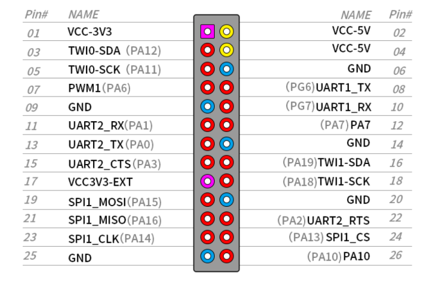

# Physical GPIO Buttons

`button_manager.py` monitors two momentary buttons connected to GPIO inputs. Each button supports a short press and a long press, allowing local recovery, WiFi reset or control actions without accessing the OliveYin Dashboard.

The reference configuration uses a five-second long-press threshold and starts commands asynchronously so GPIO event handling remains responsive.

## Button Actions

The script currently defines the following actions:

| Button | Short press | Long press |
| --- | --- | --- |
| P1 | Run `/opt/custom-scripts/reset-esp32.sh` | Run `/opt/custom-scripts/reset-wifi.sh` |
| P2 | Run `/opt/custom-scripts/custom-action.sh` | Run `/opt/custom-scripts/shutdown.sh` |


## Wiring and GPIO Configuration



The reference script uses GPIO line offsets `18` and `19` from `/dev/gpiochip0`:

```python
GPIO_CHIP = "/dev/gpiochip0"
BUTTON_P1 = 18
BUTTON_P2 = 19
```

The inputs use the internal pull-up resistor. Connect each normally open momentary button between its assigned GPIO line and GND. Pressing a button produces a falling edge; releasing it produces a rising edge.

> GPIO line offsets are not physical header pin numbers, but the GPIO reference: 18 = PA18 (pin 18), 19=PA19(pin16().


## Install Dependencies and Script

Install the Python GPIO bindings in the shared virtual environment. 

> The `gpiod` package is already installed if the optional TFT display setup has been completed.

```bash
source /opt/custom-env/bin/activate
pip install gpiod
```

Install the button manager and its dependent scripts:

```bash
install -d -m 755 /opt/custom-scripts
install -m 755 custom-scripts/button_manager.py /opt/custom-scripts/button_manager.py
install -m 755 custom-scripts/reset_wifi.sh /opt/custom-scripts/reset-wifi.sh
install -m 755 custom-scripts/shutdown.sh /opt/custom-scripts/shutdown.sh
install -m 755 custom-scripts/shutdown.sh /opt/custom-scripts/custom-action.sh
```

Review the command definitions near the top of `/opt/custom-scripts/button_manager.py` before deployment. In particular, replace or provide the scripts used for the two short-press actions.


## systemd Service

Install the supplied unit file:

```bash
install -m 644 systemd_scripts/system/button-manager.service \
  /etc/systemd/system/button-manager.service
systemctl daemon-reload
systemctl enable --now button-manager.service
systemctl status button-manager.service
```


## Test and Troubleshooting

Inspect service logs while testing each press duration:

```bash
journalctl -u button-manager.service -f
```

> The startup log reports the configured GPIO. 


## Shutdown Notification

The P2 long-press action runs `shutdown.sh`. It writes `System shutdown requested` to `/run/opizero-serial-bridge/display-notice`, sends the same notification through `telegram-send` when configured, waits three seconds, then invokes `systemctl poweroff`.

Ensure the `telegram-send` configuration is available to `root`, because `button-manager.service` runs as `root`. 

The display manager can use the runtime notice file to show a shutdown message on the optional TFT display.
